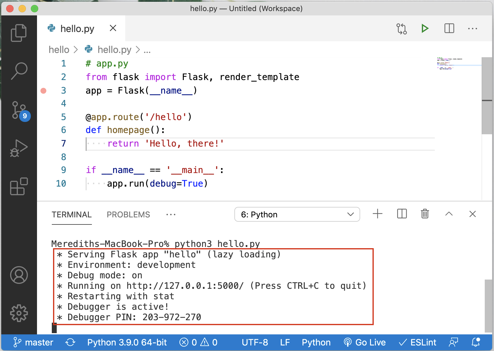

# Setting up and Using Flask Servers

ACS 1710 - Module 1: Lesson 2

## Learning Outcomes

By the end of this lesson, you should be able to...

- Create and run a Flask server using Visual Studio Code
- (Optional) Explain how Python's decorator `@` symbol aids in writing routes
- (Optional) Explain how Python's `__name__` keyword allows us to write code that will run when the program starts

## Videos 🎥

Building our first Flask server step-by-step video walkthrough

[Vid 1 - First Flask server walkthrough](https://file.notion.so/f/f/b55c22ee-fac0-43f5-b763-ad205bab0599/73aa7d96-2b1b-48ad-a993-2a229e23a5b3/1_Flask_Introduction.mov?table=block&id=f5d7bb61-fc2e-4c27-b0ab-40593c5c4c9d&spaceId=b55c22ee-fac0-43f5-b763-ad205bab0599&expirationTimestamp=1728064800000&signature=JFa9-3u6ekLXMhtaj_a7foaNzlQlRl-YHQ6m___QIZ4&downloadName=1_Flask_Introduction.mov)

https://youtu.be/PoHWcq1pLhM

Diving deeper into Python's Decorator @ syntax

[Vid 2 - exploring Python's Decorator syntax](https://file.notion.so/f/f/b55c22ee-fac0-43f5-b763-ad205bab0599/c2c210e6-86e3-4c2b-a455-e8ba870f6bbc/2_Decorators.mov?table=block&id=ecac1118-a8b4-4a9a-b882-99d40adcb7ab&spaceId=b55c22ee-fac0-43f5-b763-ad205bab0599&expirationTimestamp=1728064800000&signature=FPKDpuqVZ55JIiKJq8qM-AfgCZsRfr9ZYD72oRecLOQ&downloadName=2_Decorators.mov)

https://youtu.be/xLy7D3CaHps

Diving deeper into Python's `__name__` keyword

[Vid 3 - exploring the `__name__` keyword](https://file.notion.so/f/f/b55c22ee-fac0-43f5-b763-ad205bab0599/63bd2804-9ad5-4385-ae3f-866dbd646dae/3_Name_Keyword.mov?table=block&id=b7e6ede1-e878-418a-aacd-ebd9ec69d9d3&spaceId=b55c22ee-fac0-43f5-b763-ad205bab0599&expirationTimestamp=1728064800000&signature=ZNAJriaf421QJ03IgKO8DR89nubO4WQWwdlnqeWQh-o&downloadName=3_Name_Keyword.mov)

https://youtu.be/okQzZJD-lbg

## Exercises 💪

Send your instructor a screenshot via Slack of your functioning web server! Your screenshot should look something like this:



## Written Companion 🗒

How can we develop a server capable of generating responses?

Servers can be created using many programming languages and frameworks. In this class we will be learning to develop servers capable of serving large user bases with the Python framework Flask.

Flask = a Python framework that allows developers to create servers and routes. Flask can be a great entry point because it is a micro framework, which means that it requires no other libraries to work!

Always feel free to ask for help when learning new technologies and frameworks. While you should always give things a good attempt on your own first—do not struggle to the point of exasperation as it will kill your motivation to learn!

## Installing Flask

1. Open a terminal on your computer (this can either be a dedicated terminal app on the terminal in your code editor).
2. run the following installation command: `pip3 install flask`

See the boilerplate and video walkthrough below for step-by-step instructions on creating our first Flask server.

## Code References 📀

## What is a virtual environment? 

### Setup your Virtual Environment 

Create venv
```
python3 -m venv venv/
```

Once you have created your virtual environment, you must activate it to use it. Activate it with the following line in the terminal: 

```
source venv/bin/activate
```

You should see `(venv)` in front of you terminal prompt, it might look something like: `(venv) mitchellhudson@mitchells-MBP module-1`. 

With your virtual environment activated, install Flask with: 

```
pip3 install flask
```

This adds the Flask dependency to the virtual environment. 

## Be sure to GitIgnore Virtual Environment
Its important that you NOT commit your virtual environment! Do this by adding .gitignore file. 

Create a new file named: `.gitignore`

Add the following to this file: 

```
venv/
```

Now commit and push!

If you made a commit after creating the `venv` before adding the `.gitignore` You will need to remove `venv` from your cache. Follow the instructions here: https://stackoverflow.com/questions/14409299/does-git-remove-files-from-version-control-after-they-are-added-to-gitignore

### Terminal Commands:

- installation command = `pip3 install flask`
- running a local server = `python3 fileName.py`

### Boilerplates

Create `main.py`. Add the code below to that file. 

Run the file with: `python3 main.py`

With this Flask server running, you should see the address it is running at in the terminal, something like: `http://127.0.0.1:3000`. Paste this address into your web browser. You should see the words `Hello, World!` in the window. 

```python
# standard flask boilerplate

# import the Flask server object
from flask import Flask

# create new Flask instance and assign it a root directory of the 
# working file (should be named 'main.py')
app = Flask(__name__)

# routes can be created using @app.route('routeName')
# NOTE: Flask uses Python's decorater syntax so a function must 
# be definied directly beneath the route declaration
@app.route('/')
def homepage():
    return "Hello, world!"

# the server can be accessed in your web browser using the URL localhost:3000/
if __name__ == '__main__':
    app.run(debug=True, port=3000)
```


