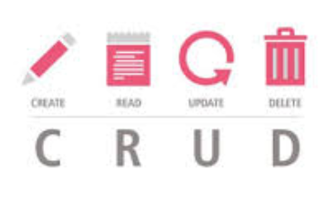

# Introduction to C.R.U.D

ACS 1710 - Module 1: Lesson 3

## Learning Outcomes 💫

By the end of this lesson, you should be able to...

- Describe the four operations of Create, Read, Update, and Delete, and give examples of each.
- For a given action that a user performs on a website, identify which operation is being performed.

## Exercises 💪

Answer the review questions for Module 1 section 2 on Gradescope. 

## Written Companion 🗒

What operations form the basis of a web application? Can we narrow them down to a set of reliable operations applicable to any situation?

The four primary operations that a web application must be able to perform fall into the acronym **C.R.U.D:**

- create - the act of creating a new set of data or inserting an element into an existing set
- read - finding and retrieving existing data
- update - modifying a currently existing data point to a new value
- delete - removing a set of data or element of data from a set

These operations form the basis of an application as it covers the range of ways a user can interact with a website.

For example, a user interacting with Facebook might:

- create - create a post to share on their wall or upload an image from their phone
- read - get a curated collection of posts their friends have made recently on their wall or pull up their list of contacts
- update - change their status, edit a recently created post, or react to something on their wall
- delete - remove a friend from their friends list or delete a post

We will be seeing these C.R.U.D. operations come up in many ways across different contexts. Whenever you see an operation performed—try to connect it to one of the C.R.U.D. concepts!

