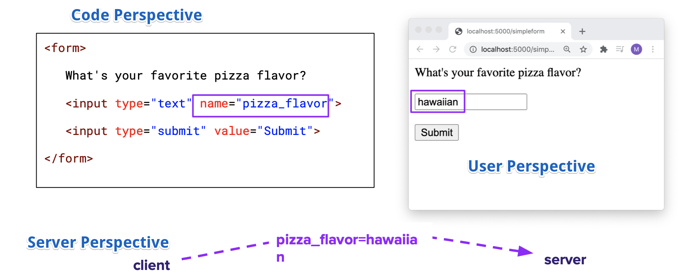

# Working with Route Variables and Forms

ACS 1710 - Module 1: Lesson 5

## Learning Outcomes 💫

By the end of this lesson, you should be able to...

- Write a flask route that collects user input using one or more route variables, and displays an appropriate response.
- Write a Flask route that displays a form.
- Write a Flask route that collects form input and displays an appropriate response.

## Videos 🎥

<!-- [Vid 1 - Route variables walkthrough](https://file.notion.so/f/f/b55c22ee-fac0-43f5-b763-ad205bab0599/159db231-fa66-43e1-bd62-ddd5cdd2a685/4_Route_Variables.mov?table=block&id=30e20935-990f-4b35-82d9-adb4755bbff7&spaceId=b55c22ee-fac0-43f5-b763-ad205bab0599&expirationTimestamp=1728064800000&signature=swJQ52qB9HH39s0cSBGtmxKv7Pi_3P9WYjJdMnZpAhw&downloadName=4_Route_Variables.mov) -->

[Vid 1 - Route variables walkthrough](https://youtu.be/RvsTEm4Y8L4)

<!-- [Vid 2 - Forms walkthrough](https://file.notion.so/f/f/b55c22ee-fac0-43f5-b763-ad205bab0599/5ecf8d34-586b-462e-9ae1-30956adfd1bf/5_Form_Introduction.mov?table=block&id=c2f3047c-95ee-4f56-b806-f4fc3775563d&spaceId=b55c22ee-fac0-43f5-b763-ad205bab0599&expirationTimestamp=1728064800000&signature=t3Lgqa0iEK2vsDwT4Vh5asGIchTQTMoBLRJ25WtDXH0&downloadName=5_Form_Introduction.mov) -->

[Vid 2 - Forms walkthrough](https://youtu.be/PqBZ9hKGaKQ)

## Exercises 💪

Test your understanding of route variables and forms with the questions below. Try to answer each one yourself before checking the answer key. (Processing submitted form data is covered in the next lesson's self-check.)

1. In the route `@app.route('/profile/<users_name>')`, what is `<users_name>` called, and how do you access its value inside the route function?
2. What are the two `<input>` tags that every `<form>` must have at minimum?
3. What does the `name` attribute on an `<input>` tag get used for on the server side?
4. What does the `action` attribute on a `<form>` tag specify? What about the `method` attribute?
5. If a `<form>` tag doesn't include a `method` attribute, which HTTP method does it default to?

<details>
<summary>Answer Key</summary>

1. It's called a **route variable**. Its value is passed into the route function as an argument with the same name (`users_name`).
2. At least one `<input>` for entering data, and one `<input type="submit">` for submitting the form.
3. It becomes the **key** used to look up that input's submitted value on the server (e.g., with `request.args.get()`).
4. `action` specifies the route URL the form's data will be sent to; `method` specifies which HTTP method (`GET` or `POST`) will be used to send it.
5. `GET`.

</details>

## Written Companion 🗒

> 🤔 We need to structure and transport information from one end-point to another(i.e. from client to server or server to client)—which way works best?

### Method 1: Route Variables

Information can be inserted into the route itself and have it processed on the server end. Data transported in this fashion would be referred to as a `route variable`.

```python
# using Flask route variables
@app.route('/profile/<users_name>')
def profile(users_name):
    return "Hello " + users_name
```

Note in the code snippet above that users_name gets passed as a route variable within the route URL path and processed as an argument in the associated function.

### Method 2: Forms

Multiple pieces of information can be tagged for collection using a `<form>` tag. A form can be composed of many types of input but always requires at **at least one `<input>` tag for information and one `<input type="submit">` tag for submission.**

`<input>` tag attributes:

- `type` = how the input will be collected (text, button, radio, etc.)
- `name` = the name of the element used for DOM referencing. On the server side, it will be used as the **key** of the **key-value** pair required for data processing.
- `value` = changes depending on the `type` of the `<input>` tag but generally refers to the **value** of the **key-value** pair utilized during data processing.

```html
<! -- minimum number of input tags required for a form -- >
<form>
   What's your favorite pizza flavor?
   <input type="text" name="pizza_flavor">
   <input type="submit" value="Submit">
</form>
```

*Fig 2 (HTML) - a standard looking <form> tag with two <input> tags*

- *Note: the "submit" type will usually take the form of a button the user presses to send information.*



`<form>` tag attributes:

- `action` = the route URL path to be utilized upon submission
    - aka: where the `<input>` tag data in the `<form>` will be sent
- `method` = the HTTP method used for transportation (default = `GET`)

```html
<! -- a form tag with an action and method attribute added to it -- >
<form action="/results" method="GET">
   What's your favorite pizza flavor?
   <input type="text" name="pizza_flavor">
   <input type="submit" value="Submit">
</form>
```

Fig 4 (HTML) - a <form> tag with an action and method attribute implemented

```python
# the route utilized by the above <form> tag
@app.route('/results', methods=['GET'])
def simple_pizza_results():
   return "Your order has been received!"
```

*Fig 5 (Python) - the route utilized by the <form> tag in fig 4* 

- *Note: in the above example, the `<form>` data was not utilized in any way! We'll look at how to do that in the next lesson.*
