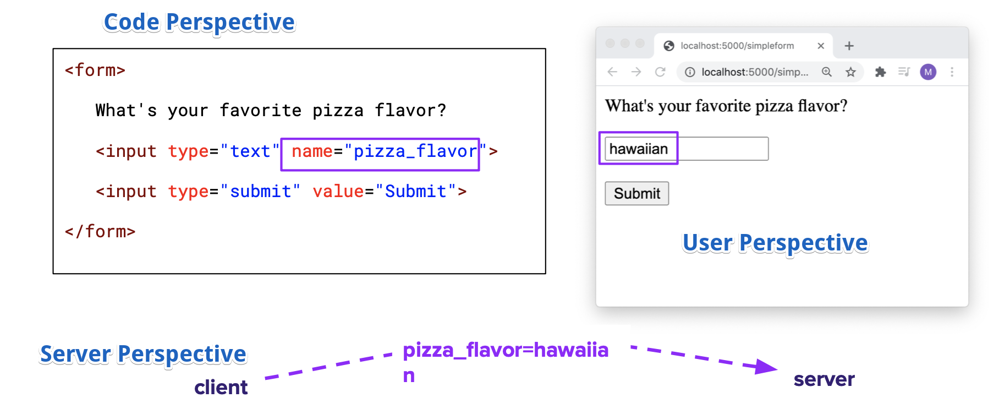

# Working with Route Variables and Forms

ACS 1710 - Module 1: Lesson 5

## Learning Outcomes 💫

By the end of this lesson, you should be able to...

- Write a flask route that collects user input using one or more route variables, and displays an appropriate response.
- Write a Flask route that displays a form.
- Write a Flask route that collects form input and displays an appropriate response.

## Videos 🎥

Vid 1 - Route variables walkthrough

https://youtu.be/RvsTEm4Y8L4

Vid 1 - Route variables walkthrough

https://youtu.be/PqBZ9hKGaKQ

## Exercises 💪

### Route Variables

Answer the review questions for Module 1 Section 4 on [Gradescope](http://gradescope.com).

## Written Companion 🗒

<aside>
🤔 We need to structure and transport information from one end-point to another(i.e. from client to server or server to client)—which way works best?
</aside>

### Method 1: Route Variables

Information can be inserted into the route itself and have it processed on the server end. Data transported in this fashion would be referred to as a `route variable`.

```python
# using Flask route variables
@app.route('/profile/<users_name>')
def profile(users_name):
    return "Hello " + users_name
```

Note in the code snippet above that users_name gets passed as a route variable within the route URL path and processed as an argument in the associated function.

### Method 2: Forms

Multiple pieces of information can be tagged for collection using a `<form>` tag. A form can be composed of many types of input but always requires at **at least one `<input>` tag for information and one `<input type="submit">` tag for submission.**

`<input>` tag attributes:

- `type` = how the input will be collected (text, button, radio, etc.)
- `name` = the name of the element used for DOM referencing. On the server side, it will be used as the **key** of the **key-value** pair required for data processing.
- `value` = changes depending on the `type` of the `<input>` tag but generally refers to the **value** of the **key-value** pair utilized during data processing.

```html
<! -- minimum number of input tags required for a form -- >
<form>
   What's your favorite pizza flavor?
   <input type="text" name="pizza_flavor">
   <input type="submit" value="Submit">
</form>
```

*Fig 2 (HTML) - a standard looking <form> tag with two <input> tags*

- *Note: the "submit" type will usually take the form of a button the user presses to send information.*



`<form>` tag attributes:

- `action` = the route URL path to be utilized upon submission
    - aka: where the `<input>` tag data in the `<form>` will be sent
- `method` = the HTTP method used for transportation (default = `GET`)

```html
<! -- a form tag with an action and method attribute added to it -- >
<form action="/results" method="GET">
   What's your favorite pizza flavor?
   <input type="text" name="pizza_flavor">
   <input type="submit" value="Submit">
</form>
```

Fig 4 (HTML) - a <form> tag with an action and method attribute implemented

```python
# the route utilized by the above <form> tag
@app.route('/results', methods=['GET'])
def simple_pizza_results():
   return "Your order has been received!"
```

*Fig 5 (Python) - the route utilized by the <form> tag in fig 4* 

- *Note: in the above example, the `<form>` data was not utilized in any way! We'll look at how to do that in the next lesson.*


