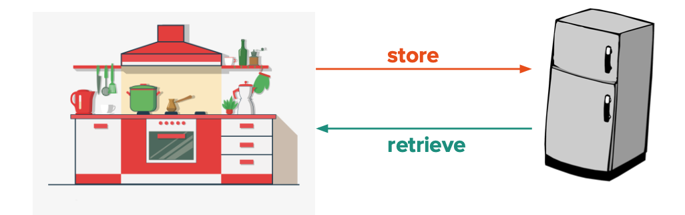

# Introduction to Databases

## 1710 - Module 5: Lesson 1

# Learning Outcomes 💫

By the end of this lesson, you should be able to...

- Explain why a database is useful to a large-scale application.

# Restful Routes

Absolutely! Here’s a short, beginner-friendly lesson on **how to name RESTful routes**:

---

## 🧭 Lesson: Naming RESTful Routes

### 📌 What is REST?

REST stands for **Representational State Transfer**. It’s a set of rules that developers follow when building web applications, especially when dealing with **resources** like users, posts, or plants.

In REST, **the URL represents the resource**, and **the HTTP method (GET, POST, PUT, DELETE)** represents the action.

### 🌱 RESTful Route Naming Basics

Let’s say we’re working with a resource called `plants`.

| Action               | HTTP Method    | Route                 | Description                        |
| -------------------- | -------------- | --------------------- | ---------------------------------- |
| View all plants      | GET            | `/plants`             | Show a list of all plants          |
| View one plant       | GET            | `/plants/<id>`        | Show details about a single plant  |
| Create a new plant   | POST           | `/plants`             | Add a new plant                    |
| Show the create form | GET            | `/plants/new`         | (Optional) Show the form to create |
| Edit a plant (form)  | GET            | `/plants/<id>/edit`   | Show the form to edit a plant      |
| Update a plant       | PUT or POST    | `/plants/<id>`        | Save updates to a plant            |
| Delete a plant       | DELETE or POST | `/plants/<id>/delete` | Remove a plant                     |

### 🔧 Why It Matters

* ✅ **Clear and predictable** — Routes tell you exactly what’s happening.
* ✅ **Easy to maintain** — Follows a common pattern developers understand.
* ✅ **Works well with frontend tools** — Makes connecting APIs and frontend simpler.

### 🧠 Quick Tips

* Use **plural nouns** for collections (`/plants`, not `/plant`).
* Avoid verbs in the route name. Let the **HTTP method do the action**.

  * ❌ `/create-plant`
  * ✅ `POST /plants`
* Use nested routes to show relationships:

  * ✅ `/plants/<id>/harvests` (harvests belong to a plant)

### ✅ Summary

RESTful routes are named using **nouns** to represent the data, and **HTTP methods** to represent what you want to do with that data. This helps keep your web app organized and easy to understand.

# Video Companions 🎥

<!-- [Video 1 - Introducing databases technologies and how they fit into an application](https://file.notion.so/f/f/6004cc36-d69e-461f-a1c5-8e5078ac8f6b/9ad0641a-4b88-4a68-8b15-ec119e08c204/RPReplay_Final1611090729.mp4?table=block&id=f428d7aa-f9d2-4414-992b-72fe01c2fa86&spaceId=6004cc36-d69e-461f-a1c5-8e5078ac8f6b&expirationTimestamp=1728064800000&signature=kJMjO2CCkbc2GBhuTP0nk2zPx-swKaAcvg00lPB1M2s&downloadName=RPReplay_Final1611090729.mp4) -->

[Video 1 - Introducing databases technologies and how they fit into an application](https://youtu.be/2K8eT3VfnuA)

Video 1 - Introducing databases technologies and how they fit into an application

# Exercises 💪

Answer the questions in the `README` file in [this Repl.it](https://repl.it/team/WebArchitecture/Module-51Introduction-to-Databases) and submit your work.

# Written Companion 🗒

<aside>
🤔 How do we store massive amounts of data in an organized fashion that can also be accessed/modified quickly?

</aside>

---

A technology designed to hold data can be defined as a **database.** Key features of a database include:

- it being a place to store data (i.e. user profiles, website usage, business transactions, etc.)
- typically stores data using **key-value** pairs that exists seperate from a web server
- multiple applications can access its data simultaneously
- stored data can be queried and analyzed efficiently
- data remains stable and non-volatile (aka values don't change in a power outage or application crash)

<aside>
💡 Separating databases from web servers allows each to perform a more specialized function! It also ensures that databases can better serve multiple destinations.

</aside>

A database has many uses, but some of the most commonly use cases include:

- being a location that user data can be easily referenced from
- simple storage
- identifying and understanding the relationships between data

A good analogy for the role a database plays in an application would be what fridges do for a kitchen. A fridge keeps food in a usable state that can be easily accessed!

*Fig 1 - we store food and retrieve food from a fridge in the same fashion we store and retrieve data in a database!*
