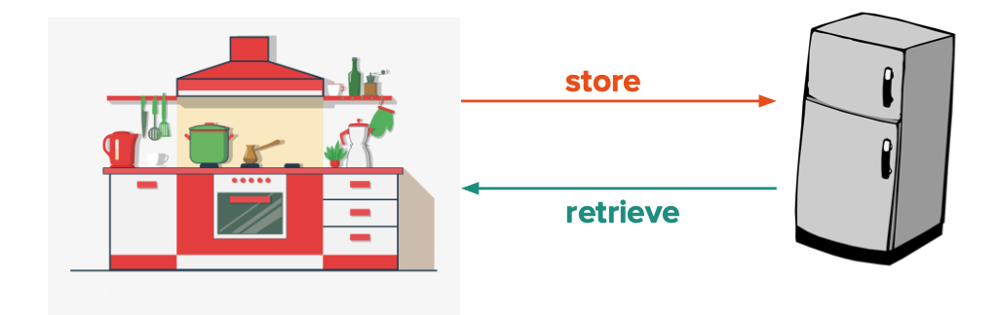

# Introduction to Databases

## ACS 1710 - Module 5: Lesson 1

# Learning Outcomes 💫

By the end of this lesson, you should be able to...

- Explain why a database is useful to a large-scale application.

# Video Companions 🎥

<!-- [Video 1 - Introducing databases technologies and how they fit into an application](https://file.notion.so/f/f/6004cc36-d69e-461f-a1c5-8e5078ac8f6b/9ad0641a-4b88-4a68-8b15-ec119e08c204/RPReplay_Final1611090729.mp4?table=block&id=f428d7aa-f9d2-4414-992b-72fe01c2fa86&spaceId=6004cc36-d69e-461f-a1c5-8e5078ac8f6b&expirationTimestamp=1728064800000&signature=kJMjO2CCkbc2GBhuTP0nk2zPx-swKaAcvg00lPB1M2s&downloadName=RPReplay_Final1611090729.mp4) -->

[Video 1 - Introducing databases technologies and how they fit into an application](https://youtu.be/2K8eT3VfnuA)

# Exercises 💪

Test your understanding of databases with the questions below. Try to answer each one yourself before checking the answer key.

1. Name two key features that make something a "database," as opposed to just a single file.
2. What analogy does this lesson use to describe the role a database plays for an application?
3. Why is it useful to keep a database separate from the web server itself?
4. True or False: A database's data is expected to disappear if the power goes out or the application crashes.

Answer Key

1. Any two of: it's a place to store data; it typically stores data using key-value pairs; multiple applications can access it simultaneously; stored data can be queried and analyzed efficiently; data remains stable and non-volatile.
2. A fridge in a kitchen — a fridge keeps food in a usable state that can be easily accessed, the same way a database keeps data in a usable state that can be easily accessed.
3. Separating them lets each perform a more specialized function, and lets the database better serve multiple applications at once, instead of being tied to just one web server.
4. **False** — a database's data is meant to be non-volatile, meaning it stays stable even through a power outage or an application crash.

# Written Companion 🗒

> 🤔 How do we store massive amounts of data in an organized fashion that can also be accessed/modified quickly?

---

A technology designed to hold data can be defined as a **database.** Key features of a database include:

- it being a place to store data (i.e. user profiles, website usage, business transactions, etc.)
- typically stores data using **key-value** pairs that exists seperate from a web server
- multiple applications can access its data simultaneously
- stored data can be queried and analyzed efficiently
- data remains stable and non-volatile (aka values don't change in a power outage or application crash)

> 💡 Separating databases from web servers allows each to perform a more specialized function! It also ensures that databases can better serve multiple destinations.

A database has many uses, but some of the most commonly use cases include:

- being a location that user data can be easily referenced from
- simple storage
- identifying and understanding the relationships between data

A good analogy for the role a database plays in an application would be what fridges do for a kitchen. A fridge keeps food in a usable state that can be easily accessed!

*Fig 1 - we store food and retrieve food from a fridge in the same fashion we store and retrieve data in a database!*
